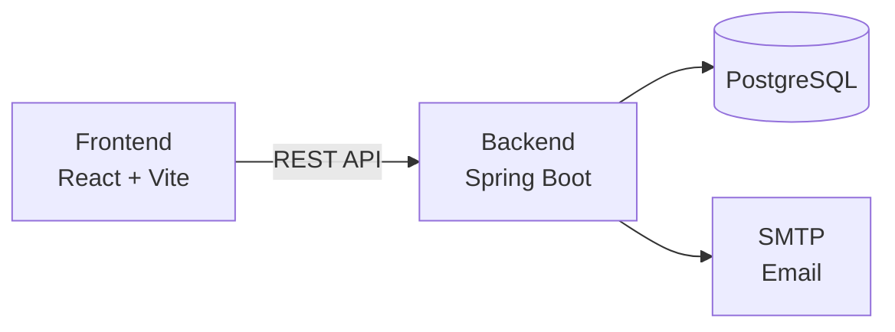
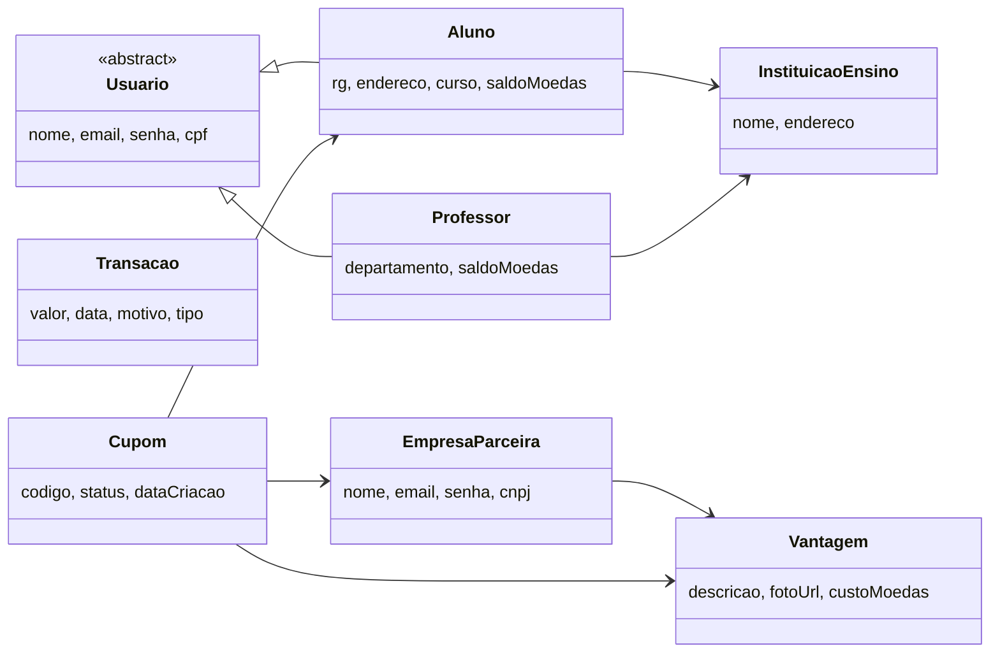

<a href="https://classroom.github.com/online_ide?assignment_repo_id=99999999&assignment_repo_type=AssignmentRepo"></a>

---

# Sistema de Moeda Estudantil

<table>
  <tr>
    <td width="800px">
      <div align="justify">
        O <b>Sistema de Moeda Estudantil</b> é uma plataforma para estimular o <i>reconhecimento do mérito estudantil</i> através de uma <b>moeda virtual</b>. Professores distribuem moedas aos seus alunos como forma de reconhecimento por bom comportamento e participação em aula. Os alunos acumulam essas moedas e podem trocá-las por <i>produtos e descontos</i> oferecidos por <b>empresas parceiras</b> cadastradas na plataforma. O sistema promove um ciclo virtuoso de <b>incentivo acadêmico</b>, conectando instituições de ensino, docentes, discentes e o mercado local.
      </div>
    </td>
    <td>
      <div>
        <!-- Espaço para logo futura, se desejar -->
      </div>
    </td>
  </tr>
</table>

---

## 🚧 Status do Projeto

[](https://github.com/arthurcbretas/Sistema_de_Moeda_Estudantil/releases)


**📌 Sprint atual:** Release 2 (Sprints 1 e 2) — Sistema de Cupons, Extratos, Emails e Estratégia de Deploy

🚀 **Acesso ao Sistema em Produção (Estratégia de Deploy Gratuito):**
- **Frontend (Vercel):** Single Page Application Vite via Vercel (Otimizado via `.env.production`)
- **Backend (Render):** Deploy Blueprint contínuo via Docker
- **Banco de Dados:** Neon Serverless PostgreSQL

---

## 📚 Índice
- [Sobre o Projeto](#-sobre-o-projeto)
- [Funcionalidades Principais](#-funcionalidades-principais)
- [Tecnologias Utilizadas](#-tecnologias-utilizadas)
- [Arquitetura](#-arquitetura)
- [Modelagem (Sprint 1)](#-modelagem-sprint-1)
- [Instalação e Execução](#-instalação-e-execução)
- [Estrutura de Pastas](#-estrutura-de-pastas)
- [Documentações Utilizadas](#-documentações-utilizadas)
- [Autores](#-autores)
- [Licença](#-licença)

---

## Sobre o Projeto

O **Sistema de Moeda Estudantil** foi desenvolvido como projeto da disciplina de **Laboratório de Desenvolvimento de Software** na PUC Minas. O sistema aborda o problema de falta de mecanismos de reconhecimento e incentivo ao mérito estudantil nas instituições de ensino.

### Problema
As instituições de ensino carecem de ferramentas digitais para reconhecer e premiar o desempenho e participação de seus alunos de forma tangível e motivadora.

### Solução
Uma plataforma web que implementa um sistema de moeda virtual onde:
- **Professores** reconhecem alunos distribuindo moedas (1.000 moedas/semestre)
- **Alunos** acumulam moedas e trocam por vantagens em empresas parceiras
- **Empresas parceiras** oferecem descontos e produtos como incentivo

### Diferenciais
- 🎯 **Reconhecimento personalizado** — professores informam o motivo do reconhecimento
- 📧 **Notificações em tempo real** — alunos são notificados por email ao receber moedas
- 🎫 **Sistema de cupons** — códigos únicos para conferência presencial nas empresas
- 📊 **Extrato detalhado** — histórico completo de transações para alunos e professores

---

## Funcionalidades Implementadas

### ✅ Concluído (Sprints 1, 2 e 3)
- [x] **Autenticação JWT (stateless):** Login e autorização por roles (Aluno, Professor, Empresa, Admin).
- [x] **Autorização RBAC (4 perfis):** Controle de acesso rigoroso nas rotas do back-end e front-end.
- [x] **CRUD completo de Aluno:** (Admin + auto-edição)
- [x] **CRUD completo de Empresa:** (Admin + auto-edição)
- [x] **CRUD completo de Professor:** (Admin + Batch Upload via CSV)
  - [📥 Baixar Template de Professores (CSV)](./template_professores.csv)
  - > ⚠️ **Segurança (MVP):** Professores cadastrados via CSV recebem o CPF como senha padrão. A funcionalidade de troca obrigatória de senha no primeiro login será implementada na Release 2.
- [x] **CRUD completo de Instituição:** (Admin)
- [x] **CRUD completo de Vantagem:** (Empresa + Admin) *Antecipação estratégica para infraestrutura*
- [x] **Painéis isolados por perfil:** Dashboards restritos por perfil.
- [x] **Vitrine Pública de Vantagens:** Acessível livremente via `/vantagens`.
- [x] **Design Responsivo:** Glassmorphism e Dark/Light Mode.

- [x] **Transações de Moedas:** Professor envia moedas para alunos com motivo obrigatório.
- [x] **Resgate de Vantagens:** Alunos resgatam produtos/descontos (geração do código único `SME-XXXX-XXXX`).
- [x] **Gestão de Cupons (Meus Cupons):** Alunos gerenciam seus códigos resgatados com histórico mantido (mesmo se vantagem for removida).
- [x] **Extrato Enriquecido:** Cards de resumo, filtros por tipo (Envio/Resgate) e visualização de saldos em tempo real.
- [x] **Recarga Semestral:** Agendador Spring (`@Scheduled`) roda 1º Fev/Ago distribuindo 1.000 moedas aos professores.
- [x] **Notificações Reais:** Envio de email transacional em tempo real (Spring Mail) para aluno e confirmações de saldo para professor.
- [x] **Deploy Nuvem Inteligente:** Pipeline com Neon (Banco), Render (Backend via Dockerfile/render.yaml) e Vercel (Frontend).
- [x] **Modelagem Diagramas:** 8 diagramas de sequência Mermaid completos para documentação de fluxos.

---

## Tecnologias Utilizadas

### Front-end

* **Framework:** React 18
* **Linguagem:** JavaScript ES6+
* **Build Tool:** Vite 5.x
* **HTTP Client:** Axios

### Back-end

* **Linguagem:** Java 17 (JDK)
* **Framework:** Spring Boot 3.x
* **Banco de Dados:** PostgreSQL 16
* **ORM:** Hibernate / Spring Data JPA
* **Autenticação:** Spring Security + JWT
* **Email:** Spring Boot Starter Mail (JavaMail)
* **Scheduler:** Spring Scheduler (@Scheduled)

### Infraestrutura

* **Build:** Maven
* **Containerização:** Docker (opcional)

---

## Arquitetura

O sistema segue a arquitetura **MVC (Model-View-Controller)** distribuída em dois módulos:

| Camada | Descrição | Tecnologia |
|---|---|---|
| **View** | Interface do usuário (SPA) | React + Vite |
| **Controller** | Endpoints REST da API | Spring Boot Controllers |
| **Service** | Lógica de negócio | Spring Boot Services |
| **Repository** | Acesso a dados | Spring Data JPA |
| **Model** | Entidades do domínio | JPA / Hibernate |
| **Database** | Persistência | PostgreSQL |

### Diagrama de Arquitetura (Resumido)



📄 **Diagrama completo:** [docs/diagramas/diagrama_componentes.md](./docs/diagramas/diagrama_componentes.md)

---

## 📐 Modelagem (Sprint 1)

A Sprint 1 produziu os seguintes artefatos de modelagem:

| Artefato | Documento |
|---|---|
| **Diagrama de Casos de Uso** | [diagrama_casos_uso.md](./docs/diagramas/diagrama_casos_uso.md) |
| **Histórias do Usuário** | [historias_usuario.md](./docs/historias_usuario.md) |
| **Diagrama de Classes** | [diagrama_classes.md](./docs/diagramas/diagrama_classes.md) |
| **Diagrama de Componentes** | [diagrama_componentes.md](./docs/diagramas/diagrama_componentes.md) |
| **Documento Consolidado** | [modelagem_sprint1.md](./docs/modelagem_sprint1.md) |
| **Diagramas de Sequência (S2)** | [docs/diagramas/](./docs/diagramas) (Cadastro, Login, Envio, Resgate, Extrato e Geral) |

### Entidades do Sistema



---

## Instalação e Execução

### Pré-requisitos

* **Java JDK:** Versão **17** ou superior
* **Node.js:** Versão LTS (v18.x ou superior)
* **PostgreSQL:** Versão 16 ou superior
* **Maven:** Versão 3.9.x ou superior
* **Docker:** (Opcional) para deploy

### Rodando Localmente

**1. Backend**
Na pasta `backend/src/main/resources`, configure as variáveis de ambiente no `application.properties` (ou defina-as na sua máquina). O sistema usa o banco de dados em nuvem ou local, dependendo das suas variáveis `PGHOST`, `PGUSER`, etc.
```bash
cd backend
./mvnw spring-boot:run
```
O backend iniciará na porta `8080`.

**2. Frontend**
Na pasta `frontend`, adicione um arquivo `.env` com a variável `VITE_API_URL=http://localhost:8080/api` (ou apontando para a nuvem).
```bash
cd frontend
npm install
npm run dev
```
O frontend iniciará na porta `5173` ou `5174`.

### Deploy em Nuvem (Render / Neon / Vercel)
- **Banco de Dados (Neon):** A conexão é garantida por certificado SSL no `application-prod.properties`.
- **Backend (Render):** O backend possui um `Dockerfile` multi-stage que compila via Maven e roda em imagem JRE leve. Existe o `render.yaml` pronto para IaC.
- **Frontend (Vercel):** O frontend possui as dependências prontas para deploy SPA rápido no Vercel com a env-var `VITE_API_URL` apontando para o Render.

---

## 📂 Estrutura de Pastas

```
Sistema_de_Moeda_Estudantil/
├── .gitignore                           # Arquivos ignorados pelo Git
├── README.md                            # Documentação principal
├── template_README.md                   # Template de referência
│
├── /docs                                # Documentação do projeto
│   ├── modelagem_sprint1.md             # Documento consolidado da Sprint 1
│   ├── historias_usuario.md             # Histórias do usuário
│   └── /diagramas                       # Diagramas UML
│       ├── diagrama_casos_uso.md        # Diagrama de Casos de Uso
│       ├── diagrama_classes.md          # Diagrama de Classes
│       └── diagrama_componentes.md      # Diagrama de Componentes
│
├── /backend                             # (Sprint 2+) Spring Boot
│   ├── pom.xml
│   └── /src/main/java/com/sme/
│       ├── /controller
│       ├── /service
│       ├── /repository
│       ├── /model
│       ├── /dto
│       ├── /config
│       └── /exception
│
└── /frontend                            # (Sprint 2+) React + Vite
    ├── package.json
    └── /src
        ├── /components
        ├── /pages
        ├── /services
        └── /styles
```

---

## 🔗 Documentações Utilizadas

* 📖 **Spring Boot:** [Documentação Oficial](https://docs.spring.io/spring-boot/docs/current/reference/html/)
* 📖 **React:** [Documentação Oficial](https://react.dev/reference/react)
* 📖 **Vite:** [Guia de Configuração](https://vitejs.dev/config/)
* 📖 **Spring Data JPA:** [Documentação](https://docs.spring.io/spring-data/jpa/docs/current/reference/html/)
* 📖 **Spring Security:** [Documentação](https://docs.spring.io/spring-security/reference/index.html)
* 📖 **PostgreSQL:** [Documentação](https://www.postgresql.org/docs/16/)
* 📖 **Mermaid (Diagramas):** [Documentação](https://mermaid.js.org/intro/)

---

## 👥 Autores

| 👤 Nome | :octocat: GitHub |
|---------|-----------------|
| Arthur C. Bretas | <div align="center"><a href="https://github.com/arthurcbretas"></a></div> |

---

## Agradecimentos

* [**Engenharia de Software PUC Minas**](https://www.instagram.com/engsoftwarepucminas/) — Pelo apoio institucional e estrutura acadêmica.
* [**Prof. Dr. João Paulo Aramuni**](https://github.com/joaopauloaramuni) — Pelos ensinamentos sobre Arquitetura de Software e Padrões de Projeto.

---

## 📄 Licença

Este projeto é distribuído sob a **Licença MIT**.

---