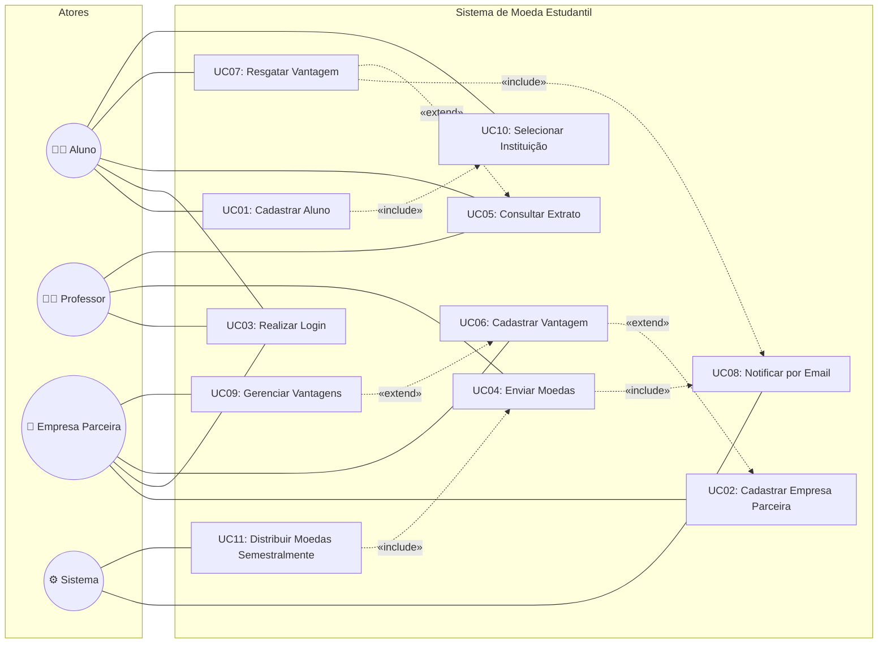

# Diagrama de Casos de Uso — Sistema de Moeda Estudantil

## Visão Geral

Este diagrama apresenta os casos de uso do sistema, organizados por ator principal. O sistema possui quatro atores: **Aluno**, **Professor**, **Empresa Parceira** e **Sistema** (ator automatizado).

---

## Diagrama

---

## Relacionamentos entre Casos de Uso

### `«include»` (obrigatórios)

| Caso Base | Inclui | Descrição |
|-----------|--------|-----------|
| UC01 (Cadastrar Aluno) | UC10 (Selecionar Instituição) | Cadastro **sempre** requer seleção de instituição |
| UC07 (Resgatar Vantagem) | UC08 (Notificar por Email) | Resgate **sempre** dispara notificação |
| UC04 (Enviar Moedas) | UC08 (Notificar por Email) | Envio **sempre** dispara notificação |
| UC11 (Distribuir Moedas) | UC04 (Enviar Moedas) | Distribuição semestral **sempre** envolve envio |

### `«extend»` (opcionais)

| Extensão | Estende | Descrição |
|----------|---------|-----------|
| UC06 (Cadastrar Vantagem) | UC02 (Cadastrar Empresa) | Empresa **pode** cadastrar vantagens ao se cadastrar |
| UC09 (Gerenciar Vantagens) | UC06 (Cadastrar Vantagem) | Empresa **pode** editar/remover ao cadastrar nova |
| UC07 (Resgatar Vantagem) | UC05 (Consultar Extrato) | Aluno **pode** resgatar após consultar extrato |

---

## Descrição dos Casos de Uso

### UC01 — Cadastrar Aluno
- **Ator:** Aluno | **Inclui:** UC10
- **Pré:** Nenhuma | **Pós:** Aluno registrado com saldo 0

### UC02 — Cadastrar Empresa Parceira
- **Ator:** Empresa Parceira | **Estendido por:** UC06
- **Pré:** Nenhuma | **Pós:** Empresa registrada

### UC03 — Realizar Login
- **Ator:** Aluno, Professor, Empresa Parceira
- **Pré:** Usuário cadastrado | **Pós:** Usuário autenticado

### UC04 — Enviar Moedas
- **Ator:** Professor | **Inclui:** UC08
- **Pré:** Autenticado, saldo suficiente | **Pós:** Moedas transferidas, email enviado

### UC05 — Consultar Extrato
- **Ator:** Aluno, Professor | **Estendido por:** UC07
- **Pré:** Autenticado | **Pós:** Extrato exibido

### UC06 — Cadastrar Vantagem
- **Ator:** Empresa Parceira | **Estendido por:** UC09
- **Pré:** Autenticada | **Pós:** Vantagem disponível para resgate

### UC07 — Resgatar Vantagem
- **Ator:** Aluno | **Inclui:** UC08
- **Pré:** Autenticado, saldo suficiente | **Pós:** Cupom gerado, emails enviados

### UC08 — Notificar por Email
- **Ator:** Sistema
- **Pré:** Evento disparador | **Pós:** Email(s) enviado(s)

### UC09 — Gerenciar Vantagens
- **Ator:** Empresa Parceira
- **Pré:** Autenticada, vantagens cadastradas | **Pós:** Vantagem atualizada/removida

### UC10 — Selecionar Instituição de Ensino
- **Ator:** Aluno
- **Pré:** Instituições pré-cadastradas | **Pós:** Instituição vinculada ao aluno

### UC11 — Distribuir Moedas Semestralmente
- **Ator:** Sistema | **Inclui:** UC04
- **Pré:** Início do semestre | **Pós:** +1.000 moedas/professor (acumulável)
