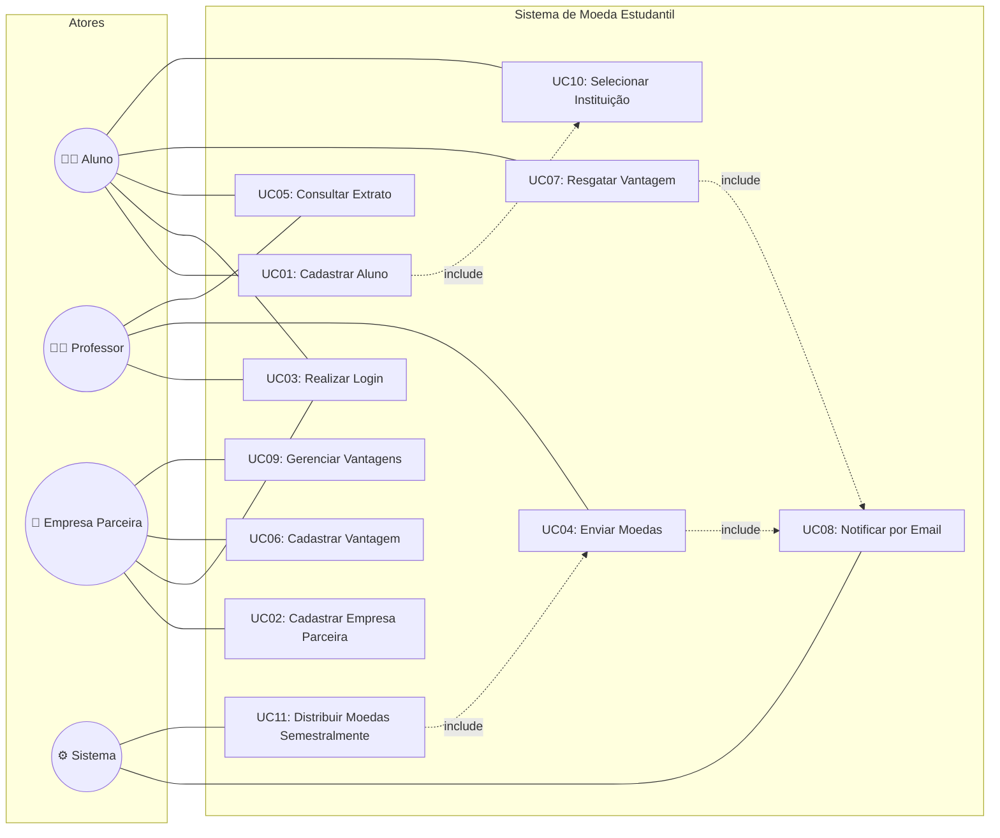

# Diagrama de Casos de Uso — Sistema de Moeda Estudantil

## Visão Geral

Este diagrama apresenta os casos de uso do sistema, organizados por ator principal. O sistema possui quatro atores: **Aluno**, **Professor**, **Empresa Parceira** e **Sistema** (ator automatizado).

---

## Diagrama

---

## Descrição dos Casos de Uso

### UC01 — Cadastrar Aluno
- **Ator Principal:** Aluno
- **Descrição:** O aluno realiza seu cadastro no sistema informando nome, email, CPF, RG, endereço, instituição de ensino (selecionada de lista pré-cadastrada) e curso. Um login (email) e senha são definidos durante o cadastro.
- **Pré-condições:** Nenhuma.
- **Pós-condições:** Aluno registrado no sistema com saldo inicial de 0 moedas.
- **Inclui:** UC10 (Selecionar Instituição)
- **Fluxo Principal:**
  1. Aluno acessa a tela de cadastro.
  2. Aluno preenche os dados pessoais (nome, email, CPF, RG, endereço, curso).
  3. Aluno seleciona a instituição de ensino da lista pré-cadastrada.
  4. Aluno define uma senha.
  5. Sistema valida unicidade do CPF e email.
  6. Sistema cria a conta do aluno com saldo de 0 moedas.
  7. Sistema exibe confirmação de cadastro.
- **Fluxo Alternativo:**
  - 5a. CPF ou email já cadastrado → Sistema exibe erro e solicita correção.

---

### UC02 — Cadastrar Empresa Parceira
- **Ator Principal:** Empresa Parceira
- **Descrição:** Uma empresa parceira se cadastra no sistema informando seus dados, incluindo as vantagens que deseja oferecer.
- **Pré-condições:** Nenhuma.
- **Pós-condições:** Empresa registrada no sistema, podendo cadastrar vantagens.
- **Fluxo Principal:**
  1. Empresa acessa a tela de cadastro.
  2. Empresa preenche os dados (nome, CNPJ, email, senha).
  3. Sistema valida unicidade do CNPJ e email.
  4. Sistema cria a conta da empresa.
  5. Sistema exibe confirmação de cadastro.
- **Fluxo Alternativo:**
  - 3a. CNPJ ou email já cadastrado → Sistema exibe erro e solicita correção.

---

### UC03 — Realizar Login
- **Ator Principal:** Aluno, Professor, Empresa Parceira
- **Descrição:** Qualquer usuário do sistema realiza autenticação com email (ou login) e senha.
- **Pré-condições:** Usuário cadastrado no sistema.
- **Pós-condições:** Usuário autenticado com acesso às funcionalidades do seu perfil.
- **Fluxo Principal:**
  1. Usuário acessa a tela de login.
  2. Usuário informa email/login e senha.
  3. Sistema valida as credenciais.
  4. Sistema redireciona para o painel correspondente ao tipo de usuário.
- **Fluxo Alternativo:**
  - 3a. Credenciais inválidas → Sistema exibe mensagem de erro.

---

### UC04 — Enviar Moedas
- **Ator Principal:** Professor
- **Descrição:** O professor envia moedas para um aluno, informando o motivo do reconhecimento (mensagem obrigatória).
- **Pré-condições:** Professor autenticado; saldo suficiente.
- **Pós-condições:** Moedas debitadas do professor e creditadas ao aluno; transação registrada; email de notificação enviado ao aluno.
- **Inclui:** UC08 (Notificar por Email)
- **Fluxo Principal:**
  1. Professor acessa a tela de envio de moedas.
  2. Professor seleciona o aluno destinatário.
  3. Professor informa a quantidade de moedas.
  4. Professor escreve o motivo do reconhecimento (obrigatório).
  5. Sistema verifica se o professor possui saldo suficiente.
  6. Sistema debita as moedas do professor e credita ao aluno.
  7. Sistema registra a transação.
  8. Sistema envia email de notificação ao aluno (UC08).
- **Fluxo Alternativo:**
  - 5a. Saldo insuficiente → Sistema exibe erro e impede a operação.
  - 4a. Motivo não preenchido → Sistema exige preenchimento.

---

### UC05 — Consultar Extrato
- **Ator Principal:** Aluno, Professor
- **Descrição:** O usuário consulta seu saldo atual e o histórico de transações realizadas.
- **Pré-condições:** Usuário autenticado.
- **Pós-condições:** Extrato exibido na tela.
- **Fluxo Principal:**
  1. Usuário acessa a tela de extrato.
  2. Sistema exibe o saldo atual de moedas.
  3. Sistema lista as transações (envios para professor; recebimentos e resgates para aluno).

---

### UC06 — Cadastrar Vantagem
- **Ator Principal:** Empresa Parceira
- **Descrição:** A empresa cadastra uma nova vantagem no sistema, incluindo descrição, foto e custo em moedas.
- **Pré-condições:** Empresa autenticada.
- **Pós-condições:** Vantagem disponível para resgate pelos alunos.
- **Fluxo Principal:**
  1. Empresa acessa a tela de cadastro de vantagens.
  2. Empresa preenche descrição, custo em moedas e faz upload da foto do produto.
  3. Sistema valida os dados (custo > 0, foto válida).
  4. Sistema salva a vantagem vinculada à empresa.

---

### UC07 — Resgatar Vantagem
- **Ator Principal:** Aluno
- **Descrição:** O aluno resgata uma vantagem, tendo o valor descontado do saldo. Um cupom com código único é gerado e enviado por email ao aluno e à empresa parceira.
- **Pré-condições:** Aluno autenticado; saldo suficiente.
- **Pós-condições:** Saldo debitado; cupom gerado; emails enviados ao aluno e à empresa.
- **Inclui:** UC08 (Notificar por Email)
- **Fluxo Principal:**
  1. Aluno acessa a lista de vantagens disponíveis.
  2. Aluno seleciona a vantagem desejada.
  3. Sistema verifica se o aluno possui saldo suficiente.
  4. Sistema debita o custo da vantagem do saldo do aluno.
  5. Sistema gera um cupom com código único.
  6. Sistema registra a transação de resgate.
  7. Sistema envia email com o cupom ao aluno (UC08).
  8. Sistema envia email com o cupom à empresa parceira (UC08).
- **Fluxo Alternativo:**
  - 3a. Saldo insuficiente → Sistema exibe erro e impede o resgate.

---

### UC08 — Notificar por Email
- **Ator Principal:** Sistema
- **Descrição:** O sistema envia notificações por email em situações específicas: recebimento de moedas e resgate de vantagens.
- **Pré-condições:** Evento que dispare a notificação (envio de moeda ou resgate).
- **Pós-condições:** Email enviado ao(s) destinatário(s).
- **Cenários de Disparo:**
  - Aluno recebe moedas → email ao aluno informando a quantidade e o motivo.
  - Aluno resgata vantagem → email ao aluno com o cupom de resgate.
  - Aluno resgata vantagem → email à empresa parceira com o código do cupom para conferência.

---

### UC09 — Gerenciar Vantagens
- **Ator Principal:** Empresa Parceira
- **Descrição:** A empresa visualiza, edita ou remove as vantagens que cadastrou no sistema.
- **Pré-condições:** Empresa autenticada; vantagem(ns) cadastrada(s).
- **Pós-condições:** Vantagem atualizada ou removida do sistema.
- **Fluxo Principal:**
  1. Empresa acessa a lista de suas vantagens.
  2. Empresa seleciona uma vantagem para editar ou excluir.
  3. Sistema aplica a alteração e salva.

---

### UC10 — Selecionar Instituição de Ensino
- **Ator Principal:** Aluno
- **Descrição:** Durante o cadastro, o aluno seleciona sua instituição de ensino a partir de uma lista pré-cadastrada.
- **Pré-condições:** Instituições já cadastradas no sistema.
- **Pós-condições:** Instituição vinculada ao aluno.
- **Fluxo Principal:**
  1. Sistema exibe lista de instituições cadastradas.
  2. Aluno seleciona sua instituição.

---

### UC11 — Distribuir Moedas Semestralmente
- **Ator Principal:** Sistema (automatizado)
- **Descrição:** A cada início de semestre, o sistema adiciona automaticamente 1.000 moedas ao saldo de cada professor cadastrado. O saldo é acumulável (moedas não distribuídas em semestres anteriores são mantidas).
- **Pré-condições:** Início do semestre letivo identificado pelo sistema.
- **Pós-condições:** Saldo de todos os professores incrementado em 1.000 moedas; registro da recarga no histórico.
- **Fluxo Principal:**
  1. Sistema identifica o início do período semestral.
  2. Sistema lista todos os professores ativos.
  3. Sistema adiciona 1.000 moedas ao saldo de cada professor.
  4. Sistema registra a operação de recarga com o semestre correspondente.
- **Regra de Negócio:**
  - O crédito é **acumulável**: se um professor não distribuir todas as moedas em um semestre, as 1.000 novas moedas são **somadas** ao saldo corrente.
