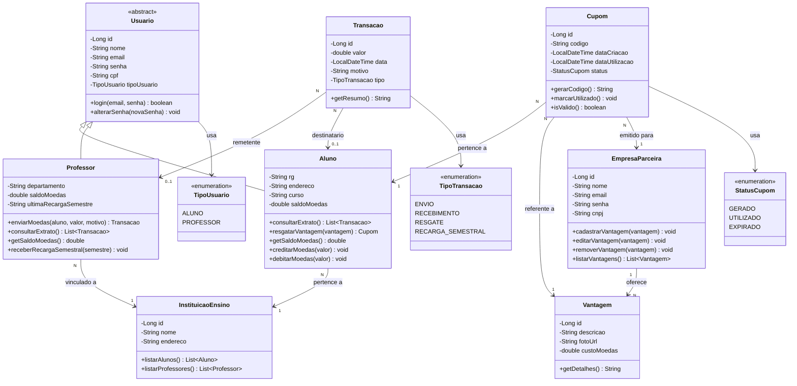

# Diagrama de Classes — Sistema de Moeda Estudantil

## Visão Geral

O diagrama de classes modela as entidades do domínio, seus atributos, métodos e relacionamentos. A modelagem segue o paradigma de orientação a objetos com herança para os tipos de usuário.

---

## Diagrama

---

## Descrição das Classes

### `Usuario` (Classe Abstrata)
Classe base para `Aluno` e `Professor`. Contém os dados comuns de autenticação e identificação.

| Atributo | Tipo | Descrição |
|----------|------|-----------|
| `id` | Long | Identificador único |
| `nome` | String | Nome completo do usuário |
| `email` | String | Email (usado como login) |
| `senha` | String | Senha de acesso (armazenada com hash) |
| `cpf` | String | CPF do usuário (único) |
| `tipoUsuario` | TipoUsuario | Discriminador: ALUNO ou PROFESSOR |

---

### `Aluno` (extends Usuario)
Representa o estudante cadastrado no sistema.

| Atributo | Tipo | Descrição |
|----------|------|-----------|
| `rg` | String | Registro Geral |
| `endereco` | String | Endereço completo |
| `curso` | String | Curso matriculado |
| `saldoMoedas` | double | Saldo atual de moedas |

**Regras de Negócio:**
- Saldo nunca pode ser negativo
- Ao resgatar vantagem, saldo deve ser >= custo da vantagem
- Recebe notificação por email ao receber moedas

---

### `Professor` (extends Usuario)
Representa o professor vinculado a uma instituição parceira.

| Atributo | Tipo | Descrição |
|----------|------|-----------|
| `departamento` | String | Departamento vinculado |
| `saldoMoedas` | double | Saldo atual de moedas para distribuição |
| `ultimaRecargaSemestre` | String | Último semestre em que recebeu recarga (ex: "2026/1") |

**Regras de Negócio:**
- Recebe 1.000 moedas a cada semestre (acumulável)
- Deve possuir saldo suficiente para enviar moedas
- Motivo do envio é obrigatório

---

### `EmpresaParceira`
Representa a empresa que oferece vantagens no sistema.

| Atributo | Tipo | Descrição |
|----------|------|-----------|
| `id` | Long | Identificador único |
| `nome` | String | Nome da empresa |
| `email` | String | Email da empresa (usado como login) |
| `senha` | String | Senha de acesso (armazenada com hash) |
| `cnpj` | String | CNPJ da empresa (único) |

> **Nota:** O `email` é utilizado como login para a empresa parceira, seguindo o mesmo padrão de Aluno e Professor.

---

### `InstituicaoEnsino`
Representa a instituição de ensino parceira (pré-cadastrada).

| Atributo | Tipo | Descrição |
|----------|------|-----------|
| `id` | Long | Identificador único |
| `nome` | String | Nome da instituição |
| `endereco` | String | Endereço da instituição |

**Regras de Negócio:**
- Instituições são pré-cadastradas no sistema (não há cadastro público)
- Alunos selecionam de lista existente durante cadastro

---

### `Vantagem`
Representa um benefício oferecido por uma empresa parceira.

| Atributo | Tipo | Descrição |
|----------|------|-----------|
| `id` | Long | Identificador único |
| `descricao` | String | Descrição da vantagem |
| `fotoUrl` | String | URL da foto/imagem do produto |
| `custoMoedas` | double | Custo em moedas para resgate |

**Regras de Negócio:**
- Custo deve ser maior que zero
- Foto é obrigatória no cadastro
- Vinculada a uma única empresa parceira

---

### `Transacao`
Registra todas as movimentações de moedas no sistema.

| Atributo | Tipo | Descrição |
|----------|------|-----------|
| `id` | Long | Identificador único |
| `valor` | double | Quantidade de moedas da transação |
| `data` | LocalDateTime | Data e hora da transação |
| `motivo` | String | Motivo/descrição da transação |
| `tipo` | TipoTransacao | Tipo da movimentação |

**Tipos de Transação:**
- `ENVIO` — Professor enviou moedas a um aluno
- `RECEBIMENTO` — Aluno recebeu moedas de um professor
- `RESGATE` — Aluno resgatou uma vantagem (débito)
- `RECARGA_SEMESTRAL` — Sistema creditou moedas ao professor

---

### `Cupom`
Representa o cupom gerado no resgate de uma vantagem.

| Atributo | Tipo | Descrição |
|----------|------|-----------|
| `id` | Long | Identificador único |
| `codigo` | String | Código alfanumérico único do cupom |
| `dataCriacao` | LocalDateTime | Data de geração do cupom |
| `dataUtilizacao` | LocalDateTime | Data em que foi utilizado (nullable) |
| `status` | StatusCupom | Estado do cupom |

**Status do Cupom:**
- `GERADO` — Cupom criado, aguardando uso presencial
- `UTILIZADO` — Cupom conferido e utilizado na empresa
- `EXPIRADO` — Cupom expirou sem utilização

**Regras de Negócio:**
- Código deve ser único no sistema (UUID ou código alfanumérico)
- Email com o código é enviado ao aluno e à empresa parceira
- O código serve para conferência na troca presencial

---

## Resumo dos Relacionamentos

| Relacionamento | Cardinalidade | Descrição |
|---|---|---|
| Aluno → InstituicaoEnsino | N : 1 | Cada aluno pertence a uma instituição |
| Professor → InstituicaoEnsino | N : 1 | Cada professor é vinculado a uma instituição |
| EmpresaParceira → Vantagem | 1 : N | Cada empresa oferece várias vantagens |
| Professor → Transacao | 1 : N | Professor pode ter várias transações de envio |
| Aluno → Transacao | 1 : N | Aluno pode ter várias transações |
| Aluno → Cupom | 1 : N | Aluno pode ter vários cupons |
| Vantagem → Cupom | 1 : N | Cada vantagem pode gerar vários cupons |
| Cupom → EmpresaParceira | N : 1 | Cada cupom é emitido para uma empresa |
