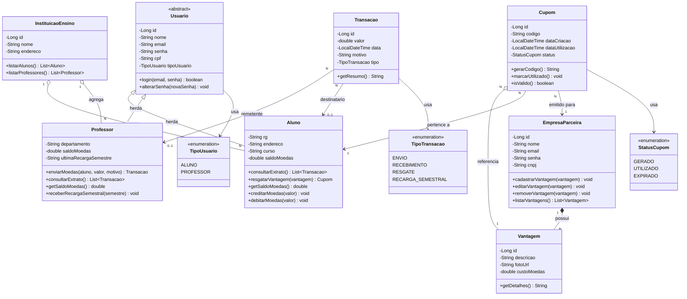

# Diagrama de Classes — Sistema de Moeda Estudantil

## Visão Geral

O diagrama de classes modela as entidades do domínio, seus atributos, métodos e relacionamentos. A modelagem segue o paradigma de orientação a objetos com **herança** para os tipos de usuário (`Aluno` e `Professor` herdam de `Usuario`), além de **composição** e **agregação** onde aplicável.

---

## Diagrama

---

## Legenda de Relacionamentos

| Símbolo | Tipo | Descrição |
|---------|------|-----------|
| `<\|--` | **Herança** | Subclasse estende superclasse |
| `*--` | **Composição** (♦ preenchido) | Parte **não existe** sem o todo. Ex: Vantagem não existe sem EmpresaParceira |
| `o--` | **Agregação** (◇ vazio) | Parte **existe independentemente** do todo. Ex: InstituicaoEnsino existe sem Aluno |
| `-->` | **Associação** | Relacionamento simples entre classes |

---

## Descrição das Classes

### `Usuario` (Classe Abstrata)
Classe base para `Aluno` e `Professor`. Contém os dados comuns de autenticação e identificação.

| Atributo | Tipo | Descrição |
|----------|------|-----------|
| `id` | Long | Identificador único |
| `nome` | String | Nome completo |
| `email` | String | Email (login) |
| `senha` | String | Senha (hash BCrypt) |
| `cpf` | String | CPF único |
| `tipoUsuario` | TipoUsuario | ALUNO ou PROFESSOR |

### `Aluno` (extends Usuario)
| Atributo | Tipo | Descrição |
|----------|------|-----------|
| `rg` | String | Registro Geral |
| `endereco` | String | Endereço completo |
| `curso` | String | Curso matriculado |
| `saldoMoedas` | double | Saldo atual de moedas |

**Regras:** Saldo nunca negativo. Resgate requer saldo >= custo.

### `Professor` (extends Usuario)
| Atributo | Tipo | Descrição |
|----------|------|-----------|
| `departamento` | String | Departamento vinculado |
| `saldoMoedas` | double | Saldo para distribuição |
| `ultimaRecargaSemestre` | String | Ex: "2026/1" |

**Regras:** 1.000 moedas/semestre (acumulável). Motivo obrigatório para envio.

### `EmpresaParceira`
| Atributo | Tipo | Descrição |
|----------|------|-----------|
| `id` | Long | Identificador |
| `nome` | String | Nome da empresa |
| `email` | String | Email (login) |
| `senha` | String | Senha (hash) |
| `cnpj` | String | CNPJ único |

### `InstituicaoEnsino`
| Atributo | Tipo | Descrição |
|----------|------|-----------|
| `id` | Long | Identificador |
| `nome` | String | Nome da instituição |
| `endereco` | String | Endereço |

### `Vantagem`
| Atributo | Tipo | Descrição |
|----------|------|-----------|
| `id` | Long | Identificador |
| `descricao` | String | Descrição |
| `fotoUrl` | String | URL da foto |
| `custoMoedas` | double | Custo em moedas |

### `Transacao`
| Atributo | Tipo | Descrição |
|----------|------|-----------|
| `id` | Long | Identificador |
| `valor` | double | Quantidade de moedas |
| `data` | LocalDateTime | Data/hora |
| `motivo` | String | Motivo/descrição |
| `tipo` | TipoTransacao | ENVIO, RECEBIMENTO, RESGATE, RECARGA_SEMESTRAL |

### `Cupom`
| Atributo | Tipo | Descrição |
|----------|------|-----------|
| `id` | Long | Identificador |
| `codigo` | String | Código único (UUID) |
| `dataCriacao` | LocalDateTime | Data de geração |
| `dataUtilizacao` | LocalDateTime | Data de uso (nullable) |
| `status` | StatusCupom | GERADO, UTILIZADO, EXPIRADO |

---

## Resumo dos Relacionamentos

| Relacionamento | Tipo | Cardinalidade | Descrição |
|---|---|---|---|
| Usuario → Aluno | Herança | — | Aluno estende Usuario |
| Usuario → Professor | Herança | — | Professor estende Usuario |
| EmpresaParceira → Vantagem | **Composição** | 1 : N | Vantagem não existe sem empresa |
| InstituicaoEnsino → Aluno | **Agregação** | 1 : N | Instituição agrega alunos |
| InstituicaoEnsino → Professor | **Agregação** | 1 : N | Instituição agrega professores |
| Cupom → Vantagem | **Agregação** | N : 1 | Cupom referencia vantagem |
| Transacao → Professor | Associação | N : 0..1 | Professor remetente |
| Transacao → Aluno | Associação | N : 0..1 | Aluno destinatário |
| Cupom → Aluno | Associação | N : 1 | Cupom pertence a aluno |
| Cupom → EmpresaParceira | Associação | N : 1 | Cupom emitido para empresa |
