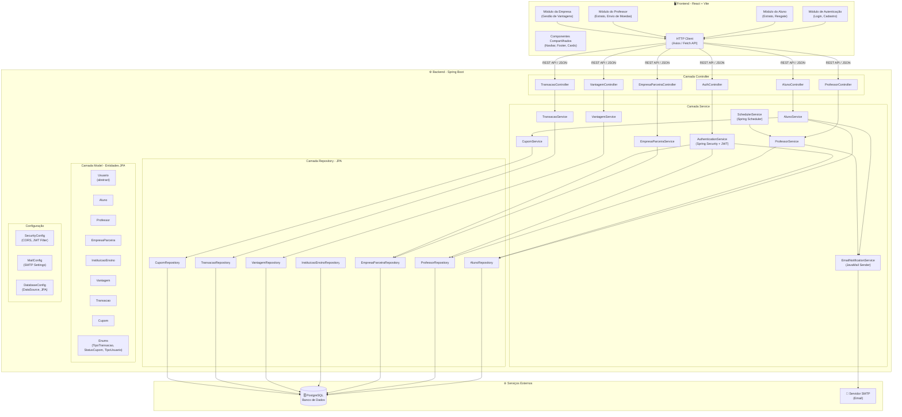
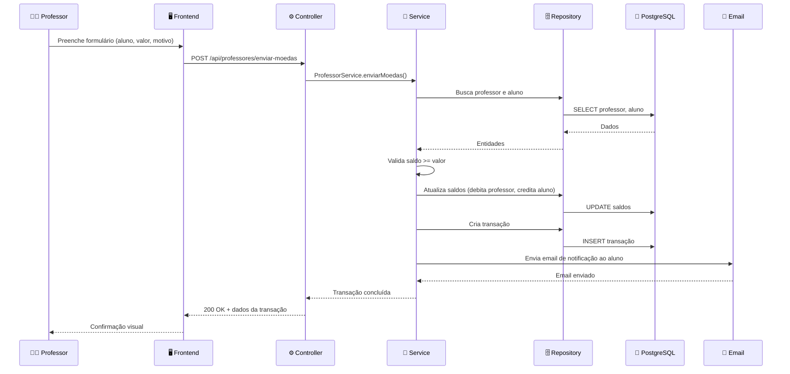
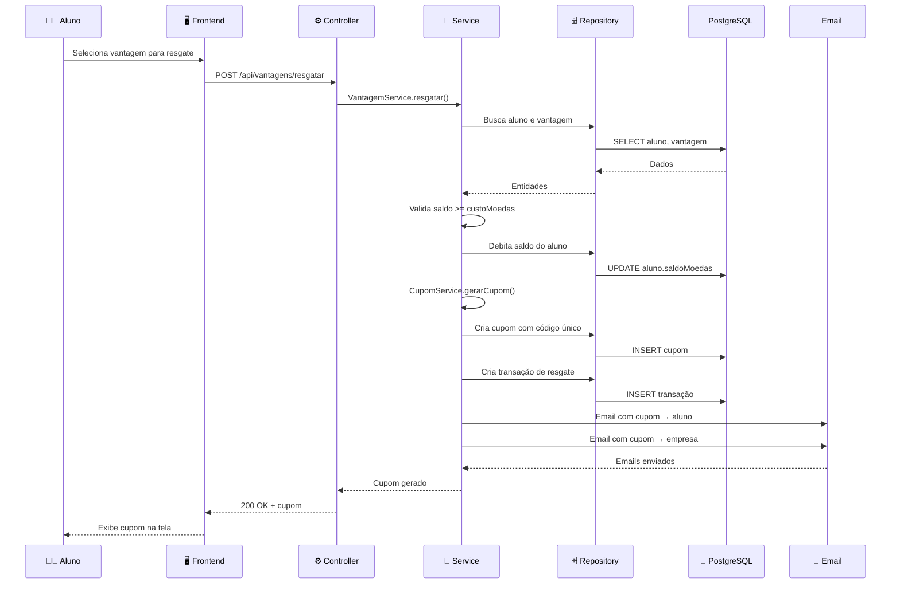

# Diagrama de Componentes — Sistema de Moeda Estudantil

## Visão Geral

O sistema segue a **arquitetura MVC (Model-View-Controller)** conforme exigido pelo projeto. A aplicação é dividida em dois módulos principais: **Frontend (View)** em React e **Backend (Controller + Model)** em Spring Boot, com comunicação via API REST.

---

## Diagrama de Componentes (Visão Geral)

---

## Descrição dos Componentes

### Camada View (Frontend — React + Vite)

| Componente | Descrição |
|---|---|
| **Módulo de Autenticação** | Telas de login e cadastro (aluno e empresa). Gerencia token JWT no localStorage. |
| **Módulo do Aluno** | Dashboard do aluno: saldo, extrato de transações, lista de vantagens e resgate. |
| **Módulo do Professor** | Dashboard do professor: saldo, extrato, formulário de envio de moedas aos alunos. |
| **Módulo da Empresa** | Dashboard da empresa: CRUD de vantagens, visualização de cupons emitidos. |
| **Componentes Compartilhados** | Navbar, Footer, Cards, Modais e outros componentes reutilizáveis da UI. |
| **HTTP Client** | Camada de comunicação com a API REST do backend via Axios ou Fetch API. |

---

### Camada Controller (Backend — Spring Boot)

| Componente | Endpoints | Descrição |
|---|---|---|
| **AuthController** | POST `/api/auth/login`, POST `/api/auth/register` | Autenticação e registro de usuários |
| **AlunoController** | GET/PUT/DELETE `/api/alunos/{id}` | Operações CRUD de alunos |
| **ProfessorController** | GET `/api/professores`, POST `/api/professores/enviar-moedas` | Consulta e envio de moedas |
| **EmpresaParceiraController** | GET/POST/PUT/DELETE `/api/empresas` | CRUD de empresas parceiras |
| **VantagemController** | GET/POST/PUT/DELETE `/api/vantagens` | CRUD de vantagens, resgate |
| **TransacaoController** | GET `/api/transacoes/extrato/{userId}` | Consulta de extrato |

---

### Camada Service (Backend — Lógica de Negócio)

| Componente | Responsabilidade |
|---|---|
| **AuthenticationService** | Validação de credenciais, geração e verificação de tokens JWT, controle de acesso por role. Usa Spring Security. |
| **AlunoService** | Regras de negócio para alunos: cadastro, consulta de extrato, resgate de vantagens, validação de saldo. |
| **ProfessorService** | Regras de negócio para professores: envio de moedas (valida saldo e motivo), recarga semestral. |
| **EmpresaParceiraService** | Regras de negócio para empresas: cadastro e gestão de vantagens. |
| **VantagemService** | Gerenciamento de vantagens: CRUD, validações. |
| **TransacaoService** | Registro e consulta de transações de todos os tipos (ENVIO, RECEBIMENTO, RESGATE, RECARGA). |
| **EmailNotificationService** | Envio de emails usando JavaMail Sender: notificação de recebimento de moedas, cupons de resgate. |
| **CupomService** | Geração de códigos únicos (UUID), gerenciamento de status do cupom (GERADO → UTILIZADO/EXPIRADO). |
| **SchedulerService** | Job agendado via `@Scheduled` do Spring para executar a recarga semestral de 1.000 moedas para cada professor. Verifica `ultimaRecargaSemestre` para evitar duplicidade. |

---

### Camada Repository (Backend — Persistência JPA)

| Componente | Entidade | Descrição |
|---|---|---|
| **AlunoRepository** | Aluno | Interface JPA para operações no banco de dados de alunos |
| **ProfessorRepository** | Professor | Interface JPA para professores |
| **EmpresaParceiraRepository** | EmpresaParceira | Interface JPA para empresas |
| **InstituicaoEnsinoRepository** | InstituicaoEnsino | Interface JPA para instituições |
| **VantagemRepository** | Vantagem | Interface JPA para vantagens |
| **TransacaoRepository** | Transacao | Interface JPA para transações |
| **CupomRepository** | Cupom | Interface JPA para cupons |

---

### Camada Model (Entidades JPA)

As entidades persistentes mapeadas com JPA/Hibernate. Detalhes no [Diagrama de Classes](./diagrama_classes.md).

---

### Configuração

| Componente | Descrição |
|---|---|
| **SecurityConfig** | Configuração do Spring Security: CORS, filtros JWT, permissões de endpoints públicos/privados. |
| **MailConfig** | Configuração do servidor SMTP para envio de emails (host, porta, credenciais). |
| **DatabaseConfig** | Configuração da fonte de dados (DataSource), dialect do Hibernate e estratégia de DDL. |

---

### Serviços Externos

| Componente | Descrição |
|---|---|
| **PostgreSQL** | Banco de dados relacional para persistência de todas as entidades do sistema. |
| **Servidor SMTP** | Servidor de email para envio de notificações (ex: Gmail SMTP, Mailtrap, SendGrid). |

---

## Fluxo de Dados

### Fluxo: Professor envia moedas ao Aluno

### Fluxo: Aluno resgata Vantagem

---

## Tecnologias por Camada

| Camada | Tecnologia |
|---|---|
| **View** | React 18 + Vite + Axios |
| **Controller** | Spring Boot 3.x (REST Controllers) |
| **Service** | Spring Boot (Service Layer) |
| **Repository** | Spring Data JPA (Hibernate) |
| **Model** | Entidades JPA com anotações |
| **Banco de Dados** | PostgreSQL 16 |
| **Autenticação** | Spring Security + JWT |
| **Email** | JavaMail Sender (Spring Boot Starter Mail) |
| **Scheduler** | Spring Scheduler (@Scheduled) |
