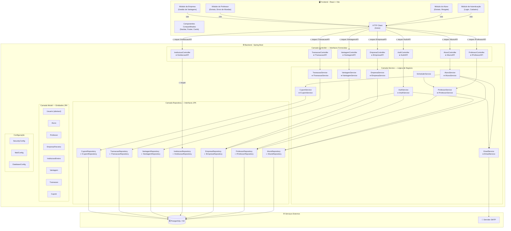

# Diagrama de Componentes — Sistema de Moeda Estudantil

## Visão Geral

O sistema segue a **arquitetura MVC (Model-View-Controller)** distribuída em dois módulos: **Frontend (View)** em React e **Backend (Controller + Model)** em Spring Boot, com comunicação via API REST. Os componentes expõem **interfaces fornecidas** (●) e consomem **interfaces requeridas** (◐).

---

## Diagrama de Componentes com Interfaces

---

## Interfaces Fornecidas e Requeridas

### Interfaces Fornecidas (● — Provided)

Cada componente **fornece** uma interface que pode ser consumida por outros componentes.

| Componente | Interface Fornecida | Operações |
|---|---|---|
| AlunoController | `● IAlunoAPI` | GET, POST, PUT, DELETE `/api/alunos` |
| EmpresaController | `● IEmpresaAPI` | GET, POST, PUT, DELETE `/api/empresas` |
| ProfessorController | `● IProfessorAPI` | GET, POST `/api/professores` |
| VantagemController | `● IVantagemAPI` | GET, POST, PUT, DELETE `/api/vantagens` |
| TransacaoController | `● ITransacaoAPI` | GET `/api/transacoes/extrato/{id}` |
| AuthController | `● IAuthAPI` | POST `/api/auth/login`, `/api/auth/register` |
| InstituicaoController | `● IInstituicaoAPI` | GET `/api/instituicoes` |
| AlunoService | `● IAlunoService` | cadastrar, atualizar, buscar, remover, validarCpf |
| EmpresaService | `● IEmpresaService` | cadastrar, atualizar, buscar, remover, validarCnpj |
| EmailService | `● IEmailService` | enviarNotificacao, enviarCupom |
| CupomService | `● ICupomService` | gerarCupom, marcarUtilizado |

### Interfaces Requeridas (◐ — Required)

Cada componente **requer** interfaces de outros componentes para funcionar.

| Componente | Requer | Interface |
|---|---|---|
| HTTP Client (Frontend) | Controllers (Backend) | `◐ IAlunoAPI`, `◐ IEmpresaAPI`, etc. |
| AlunoController | AlunoService | `◐ IAlunoService` |
| EmpresaController | EmpresaService | `◐ IEmpresaService` |
| AlunoService | AlunoRepository | `◐ IAlunoRepository` |
| AlunoService | EmailService | `◐ IEmailService` |
| EmpresaService | EmpresaRepository | `◐ IEmpresaRepository` |
| Repositories (JPA) | Banco de Dados | `◐ JDBC/DataSource` |

---

## Descrição dos Componentes

### Camada View (Frontend — React + Vite)

| Componente | Descrição |
|---|---|
| **Módulo de Autenticação** | Telas de login e cadastro. Gerencia token JWT no localStorage. |
| **Módulo do Aluno** | Dashboard: saldo, extrato, vantagens e resgate. |
| **Módulo do Professor** | Dashboard: saldo, extrato, envio de moedas. |
| **Módulo da Empresa** | Dashboard: CRUD de vantagens, cupons emitidos. |
| **Componentes Compartilhados** | Navbar, Footer, Cards, Modais reutilizáveis. |
| **HTTP Client** | Axios com interceptors para JWT e tratamento de erros. |

### Camada Controller

| Componente | Endpoints | Interface Fornecida |
|---|---|---|
| AuthController | POST `/api/auth/login`, `/register` | `● IAuthAPI` |
| AlunoController | GET/POST/PUT/DELETE `/api/alunos` | `● IAlunoAPI` |
| EmpresaController | GET/POST/PUT/DELETE `/api/empresas` | `● IEmpresaAPI` |
| InstituicaoController | GET `/api/instituicoes` | `● IInstituicaoAPI` |
| ProfessorController | GET, POST `/api/professores` | `● IProfessorAPI` |
| VantagemController | GET/POST/PUT/DELETE `/api/vantagens` | `● IVantagemAPI` |
| TransacaoController | GET `/api/transacoes/extrato/{id}` | `● ITransacaoAPI` |

### Camada Service

| Componente | Responsabilidade | Interface Fornecida |
|---|---|---|
| AlunoService | CRUD alunos, validação CPF, saldo | `● IAlunoService` |
| EmpresaService | CRUD empresas, validação CNPJ | `● IEmpresaService` |
| ProfessorService | Envio moedas, recarga semestral | `● IProfessorService` |
| VantagemService | CRUD vantagens | `● IVantagemService` |
| TransacaoService | Registro e consulta transações | `● ITransacaoService` |
| EmailService | Envio de notificações (JavaMail) | `● IEmailService` |
| CupomService | Geração de cupons (UUID) | `● ICupomService` |
| SchedulerService | Job agendado recarga semestral | — |

### Camada Repository (JPA)

| Componente | Entidade | Interface |
|---|---|---|
| AlunoRepository | Aluno | `◐ IAlunoRepository` |
| ProfessorRepository | Professor | `◐ IProfessorRepository` |
| EmpresaRepository | EmpresaParceira | `◐ IEmpresaRepository` |
| InstituicaoRepository | InstituicaoEnsino | `◐ IInstituicaoRepository` |
| VantagemRepository | Vantagem | `◐ IVantagemRepository` |
| TransacaoRepository | Transacao | `◐ ITransacaoRepository` |
| CupomRepository | Cupom | `◐ ICupomRepository` |

---

## Tecnologias por Camada

| Camada | Tecnologia |
|---|---|
| **View** | React 18 + Vite + Axios |
| **Controller** | Spring Boot 3.x (REST Controllers) |
| **Service** | Spring Boot (Service Layer) |
| **Repository** | Spring Data JPA (Hibernate) |
| **Model** | Entidades JPA com anotações |
| **Banco de Dados** | H2 (dev) / PostgreSQL (prod) |
| **Autenticação** | Spring Security + JWT (Sprint 3) |
| **Email** | JavaMail Sender (Sprint 3) |
