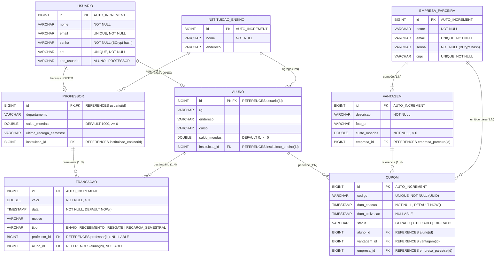

# Diagrama Entidade-Relacionamento (ER) — Sistema de Moeda Estudantil

## Visão Geral

O modelo ER define a estrutura de persistência do sistema. A estratégia de herança adotada é **JOINED** (uma tabela por subclasse com FK para a tabela pai `usuario`).

**Estratégia de acesso ao banco:** ORM com **Spring Data JPA (Hibernate)** — mapeamento objeto-relacional automático.

---

## Diagrama ER



---

## Estratégia de Herança: JOINED

```
┌──────────────────────┐
│      USUARIO         │ ← Tabela pai (dados comuns)
│  id, nome, email,    │
│  senha, cpf, tipo    │
└──────────┬───────────┘
           │ PK = FK
     ┌─────┴─────┐
     │           │
┌────┴────┐ ┌───┴─────┐
│  ALUNO  │ │PROFESSOR│ ← Tabelas filhas (dados específicos)
│ rg, end,│ │ depto,  │
│ curso,  │ │ saldo,  │
│ saldo   │ │ recarga │
└─────────┘ └─────────┘
```

**Justificativa:** A estratégia JOINED foi escolhida porque Aluno e Professor têm atributos significativamente diferentes. Evita colunas nulas (problema do SINGLE_TABLE) e mantém normalização adequada.

---

## DDL de Referência (SQL)

```sql
-- Tabela base (herança)
CREATE TABLE usuario (
    id BIGSERIAL PRIMARY KEY,
    nome VARCHAR(255) NOT NULL,
    email VARCHAR(255) UNIQUE NOT NULL,
    senha VARCHAR(255) NOT NULL,
    cpf VARCHAR(14) UNIQUE NOT NULL,
    tipo_usuario VARCHAR(20) NOT NULL
);

-- Tabela aluno (herança JOINED)
CREATE TABLE aluno (
    id BIGINT PRIMARY KEY REFERENCES usuario(id) ON DELETE CASCADE,
    rg VARCHAR(20),
    endereco VARCHAR(500),
    curso VARCHAR(100),
    saldo_moedas DOUBLE PRECISION DEFAULT 0 CHECK (saldo_moedas >= 0),
    instituicao_id BIGINT REFERENCES instituicao_ensino(id)
);

-- Tabela professor (herança JOINED)
CREATE TABLE professor (
    id BIGINT PRIMARY KEY REFERENCES usuario(id) ON DELETE CASCADE,
    departamento VARCHAR(100),
    saldo_moedas DOUBLE PRECISION DEFAULT 1000 CHECK (saldo_moedas >= 0),
    ultima_recarga_semestre VARCHAR(10),
    instituicao_id BIGINT REFERENCES instituicao_ensino(id)
);

-- Tabela empresa_parceira
CREATE TABLE empresa_parceira (
    id BIGSERIAL PRIMARY KEY,
    nome VARCHAR(255) NOT NULL,
    email VARCHAR(255) UNIQUE NOT NULL,
    senha VARCHAR(255) NOT NULL,
    cnpj VARCHAR(18) UNIQUE NOT NULL
);

-- Tabela instituicao_ensino
CREATE TABLE instituicao_ensino (
    id BIGSERIAL PRIMARY KEY,
    nome VARCHAR(255) NOT NULL,
    endereco VARCHAR(500)
);

-- Tabela vantagem (composição com empresa)
CREATE TABLE vantagem (
    id BIGSERIAL PRIMARY KEY,
    descricao VARCHAR(500) NOT NULL,
    foto_url VARCHAR(500),
    custo_moedas DOUBLE PRECISION NOT NULL CHECK (custo_moedas > 0),
    empresa_id BIGINT NOT NULL REFERENCES empresa_parceira(id) ON DELETE CASCADE
);

-- Tabela transacao
CREATE TABLE transacao (
    id BIGSERIAL PRIMARY KEY,
    valor DOUBLE PRECISION NOT NULL CHECK (valor > 0),
    data TIMESTAMP NOT NULL DEFAULT CURRENT_TIMESTAMP,
    motivo VARCHAR(500),
    tipo VARCHAR(30) NOT NULL,
    professor_id BIGINT REFERENCES professor(id),
    aluno_id BIGINT REFERENCES aluno(id)
);

-- Tabela cupom
CREATE TABLE cupom (
    id BIGSERIAL PRIMARY KEY,
    codigo VARCHAR(36) UNIQUE NOT NULL,
    data_criacao TIMESTAMP NOT NULL DEFAULT CURRENT_TIMESTAMP,
    data_utilizacao TIMESTAMP,
    status VARCHAR(20) NOT NULL DEFAULT 'GERADO',
    aluno_id BIGINT NOT NULL REFERENCES aluno(id),
    vantagem_id BIGINT NOT NULL REFERENCES vantagem(id),
    empresa_id BIGINT NOT NULL REFERENCES empresa_parceira(id)
);
```

---

## Mapeamento ORM (JPA/Hibernate)

| Entidade Java | Tabela BD | Estratégia |
|---|---|---|
| `Usuario` (abstract) | `usuario` | `@Inheritance(JOINED)` |
| `Aluno` | `aluno` | `@Entity`, extends Usuario |
| `Professor` | `professor` | `@Entity`, extends Usuario |
| `EmpresaParceira` | `empresa_parceira` | `@Entity` (independente) |
| `InstituicaoEnsino` | `instituicao_ensino` | `@Entity` |
| `Vantagem` | `vantagem` | `@Entity`, `@ManyToOne` → EmpresaParceira |
| `Transacao` | `transacao` | `@Entity`, `@ManyToOne` → Professor, Aluno |
| `Cupom` | `cupom` | `@Entity`, `@ManyToOne` → Aluno, Vantagem, Empresa |
