# Diagrama Entidade-Relacionamento Conceitual (Notação Chen)

Este diagrama representa o modelo Entidade-Relacionamento conceitual clássico (Notação de Peter Chen) das entidades da Release 1 do Sistema de Moeda Estudantil.

- **Retângulos:** Entidades Fortes
- **Losangos:** Relacionamentos
- **Elipses (Bolas):** Atributos (Chaves primárias sublinhadas visualmente e atributos compostos detalhados).

```mermaid
flowchart TD
    %% =========== ENTIDADES (Retângulos) ===========
    Aluno[Aluno]
    Professor[Professor]
    Inst[InstituicaoEnsino]
    Empresa[EmpresaParceira]
    Vantagem[Vantagem]

    %% =========== RELACIONAMENTOS (Losangos) ===========
    rel1{Estuda em}
    rel2{Leciona em}
    rel3{Oferece}
    rel4{Resgata}

    %% =========== CONEXÕES PRINCIPAIS ===========
    Aluno ---|1| rel1 ---|N| Inst
    Professor ---|1| rel2 ---|N| Inst
    Empresa ---|1| rel3 ---|N| Vantagem
    Aluno ---|N| rel4 ---|N| Vantagem

    %% =========== ATRIBUTOS: ALUNO ===========
    A_id([id])
    A_nome([nome])
    A_cpf([cpf])
    A_email([email])
    A_rg([rg])
    A_saldo([saldoMoedas])
    Aluno --- A_id
    Aluno --- A_nome
    Aluno --- A_cpf
    Aluno --- A_email
    Aluno --- A_rg
    Aluno --- A_saldo

    %% =========== ATRIBUTOS: PROFESSOR ===========
    P_id([id])
    P_nome([nome])
    P_cpf([cpf])
    P_dep([departamento])
    P_saldo([saldoMoedas])
    Professor --- P_id
    Professor --- P_nome
    Professor --- P_cpf
    Professor --- P_dep
    Professor --- P_saldo

    %% =========== ATRIBUTOS: INSTITUICAO ===========
    I_id([id])
    I_nome([nome])
    Inst --- I_id
    Inst --- I_nome

    %% =========== ATRIBUTOS: EMPRESA ===========
    E_id([id])
    E_nome([nome])
    E_cnpj([cnpj])
    E_email([email])
    Empresa --- E_id
    Empresa --- E_nome
    Empresa --- E_cnpj
    Empresa --- E_email

    %% =========== ATRIBUTOS: VANTAGEM ===========
    V_id([id])
    V_desc([descricao])
    V_custo([custoMoedas])
    V_foto([fotoUrl])
    Vantagem --- V_id
    Vantagem --- V_desc
    Vantagem --- V_custo
    Vantagem --- V_foto

    %% =========== ESTILIZAÇÃO (Simulação Chen) ===========
    classDef entity fill:#b2dfdb,stroke:#00695c,stroke-width:2px;
    classDef relation fill:#e0f2f1,stroke:#00695c,stroke-width:2px;
    classDef attribute fill:#e0f7fa,stroke:#00838f,stroke-width:1px;

    class Aluno,Professor,Inst,Empresa,Vantagem entity;
    class rel1,rel2,rel3,rel4 relation;
    class A_id,A_nome,A_cpf,A_email,A_rg,A_saldo attribute;
    class P_id,P_nome,P_cpf,P_dep,P_saldo attribute;
    class I_id,I_nome attribute;
    class E_id,E_nome,E_cnpj,E_email attribute;
    class V_id,V_desc,V_custo,V_foto attribute;
```

