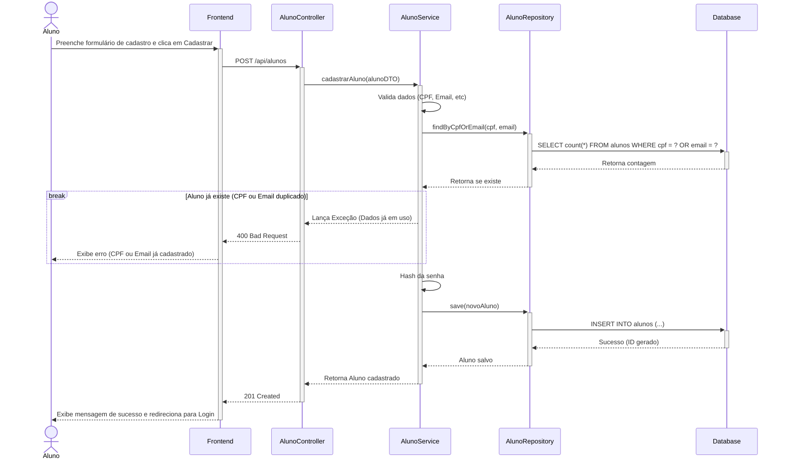

# Diagrama de Sequência: Cadastro de Aluno

```mermaid
sequenceDiagram
    actor U as Aluno
    participant F as Frontend
    participant C as AlunoController
    participant S as AlunoService
    participant R as AlunoRepository
    participant DB as Database

    U->>+F: Preenche formulário de cadastro e clica em Cadastrar
    F->>+C: POST /api/alunos
    C->>+S: cadastrarAluno(alunoDTO)
    S->>S: Valida dados (CPF, Email, etc)
    S->>+R: findByCpfOrEmail(cpf, email)
    R->>+DB: SELECT count(*) FROM alunos WHERE cpf = ? OR email = ?
    DB-->>-R: Retorna contagem
    R-->>-S: Retorna se existe

    break Aluno já existe (CPF ou Email duplicado)
        S-->>C: Lança Exceção (Dados já em uso)
        C-->>F: 400 Bad Request
        F-->>U: Exibe erro (CPF ou Email já cadastrado)
    end

    S->>S: Hash da senha
    S->>+R: save(novoAluno)
    R->>+DB: INSERT INTO alunos (...)
    DB-->>-R: Sucesso (ID gerado)
    R-->>-S: Aluno salvo
    S-->>-C: Retorna Aluno cadastrado
    C-->>-F: 201 Created
    F-->>-U: Exibe mensagem de sucesso e redireciona para Login
```
