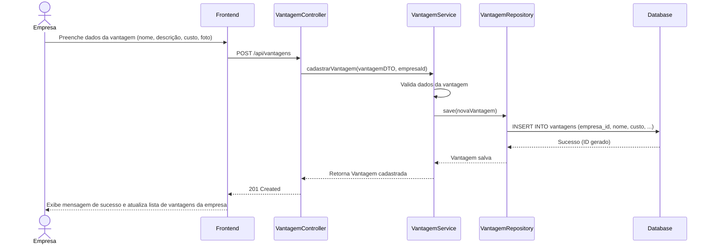

# Diagrama de Sequência: Cadastro de Vantagem

```mermaid
sequenceDiagram
    actor E as Empresa
    participant F as Frontend
    participant C as VantagemController
    participant S as VantagemService
    participant R_Vant as VantagemRepository
    participant DB as Database

    E->>F: Preenche dados da vantagem (nome, descrição, custo, foto)
    F->>C: POST /api/vantagens
    C->>S: cadastrarVantagem(vantagemDTO, empresaId)
    S->>S: Valida dados da vantagem
    S->>R_Vant: save(novaVantagem)
    R_Vant->>DB: INSERT INTO vantagens (empresa_id, nome, custo, ...)
    DB-->>R_Vant: Sucesso (ID gerado)
    R_Vant-->>S: Vantagem salva
    S-->>C: Retorna Vantagem cadastrada
    C-->>F: 201 Created
    F-->>E: Exibe mensagem de sucesso e atualiza lista de vantagens da empresa
```
