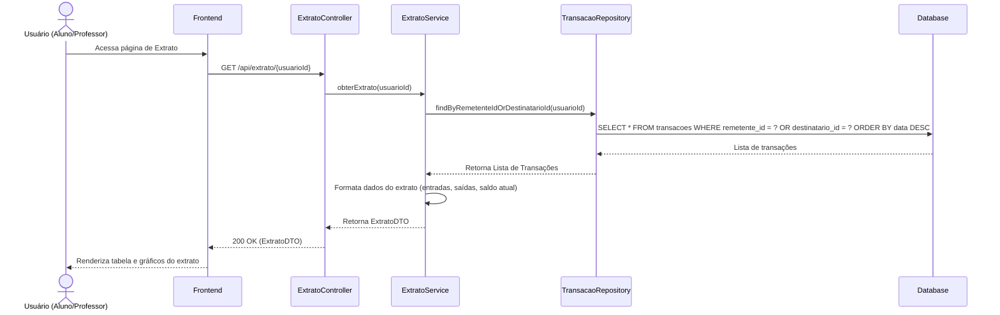

# Diagrama de Sequência: Consulta de Extrato

```mermaid
sequenceDiagram
    actor U as Usuário (Aluno/Professor)
    participant F as Frontend
    participant C as ExtratoController
    participant S as ExtratoService
    participant R_Trans as TransacaoRepository
    participant DB as Database

    U->>F: Acessa página de Extrato
    F->>C: GET /api/extrato/{usuarioId}
    C->>S: obterExtrato(usuarioId)
    S->>R_Trans: findByRemetenteIdOrDestinatarioId(usuarioId)
    R_Trans->>DB: SELECT * FROM transacoes WHERE remetente_id = ? OR destinatario_id = ? ORDER BY data DESC
    DB-->>R_Trans: Lista de transações
    R_Trans-->>S: Retorna Lista de Transações
    S->>S: Formata dados do extrato (entradas, saídas, saldo atual)
    S-->>C: Retorna ExtratoDTO
    C-->>F: 200 OK (ExtratoDTO)
    F-->>U: Renderiza tabela e gráficos do extrato
```
