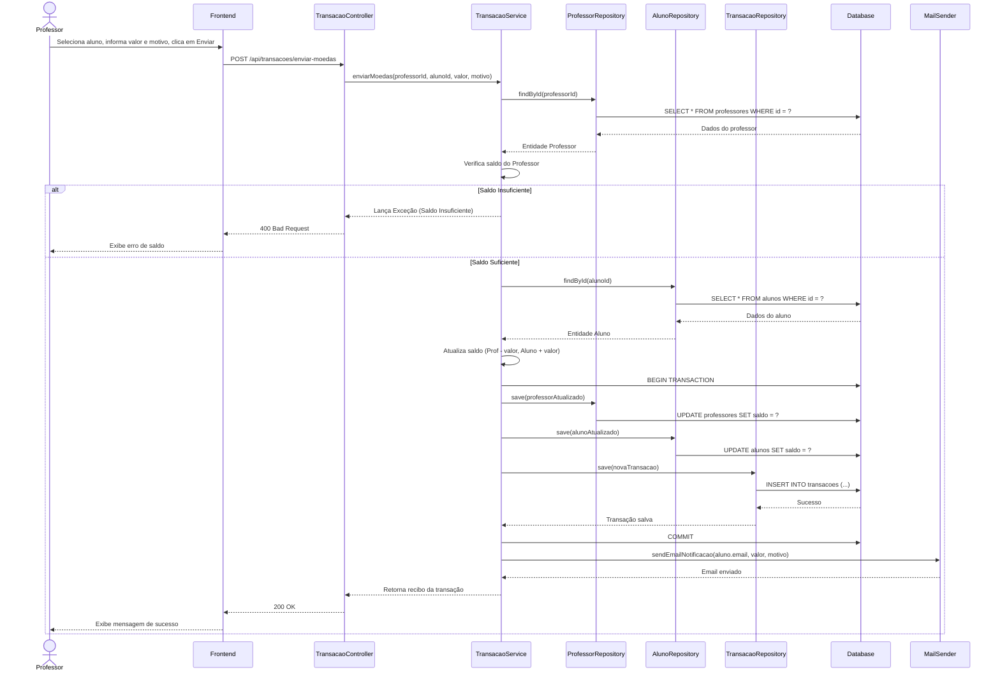

# Diagrama de Sequência: Envio de Moedas

```mermaid
sequenceDiagram
    actor P as Professor
    participant F as Frontend
    participant C as TransacaoController
    participant S as TransacaoService
    participant R_Prof as ProfessorRepository
    participant R_Aluno as AlunoRepository
    participant R_Trans as TransacaoRepository
    participant DB as Database
    participant M as MailSender

    P->>F: Seleciona aluno, informa valor e motivo, clica em Enviar
    F->>C: POST /api/transacoes/enviar-moedas
    C->>S: enviarMoedas(professorId, alunoId, valor, motivo)
    S->>R_Prof: findById(professorId)
    R_Prof->>DB: SELECT * FROM professores WHERE id = ?
    DB-->>R_Prof: Dados do professor
    R_Prof-->>S: Entidade Professor
    
    S->>S: Verifica saldo do Professor
    alt Saldo Insuficiente
        S-->>C: Lança Exceção (Saldo Insuficiente)
        C-->>F: 400 Bad Request
        F-->>P: Exibe erro de saldo
    else Saldo Suficiente
        S->>R_Aluno: findById(alunoId)
        R_Aluno->>DB: SELECT * FROM alunos WHERE id = ?
        DB-->>R_Aluno: Dados do aluno
        R_Aluno-->>S: Entidade Aluno
        
        S->>S: Atualiza saldo (Prof - valor, Aluno + valor)
        S->>DB: BEGIN TRANSACTION
        S->>R_Prof: save(professorAtualizado)
        R_Prof->>DB: UPDATE professores SET saldo = ?
        S->>R_Aluno: save(alunoAtualizado)
        R_Aluno->>DB: UPDATE alunos SET saldo = ?
        
        S->>R_Trans: save(novaTransacao)
        R_Trans->>DB: INSERT INTO transacoes (...)
        DB-->>R_Trans: Sucesso
        R_Trans-->>S: Transação salva
        S->>DB: COMMIT
        
        S->>M: sendEmailNotificacao(aluno.email, valor, motivo)
        M-->>S: Email enviado
        
        S-->>C: Retorna recibo da transação
        C-->>F: 200 OK
        F-->>P: Exibe mensagem de sucesso
    end
```
