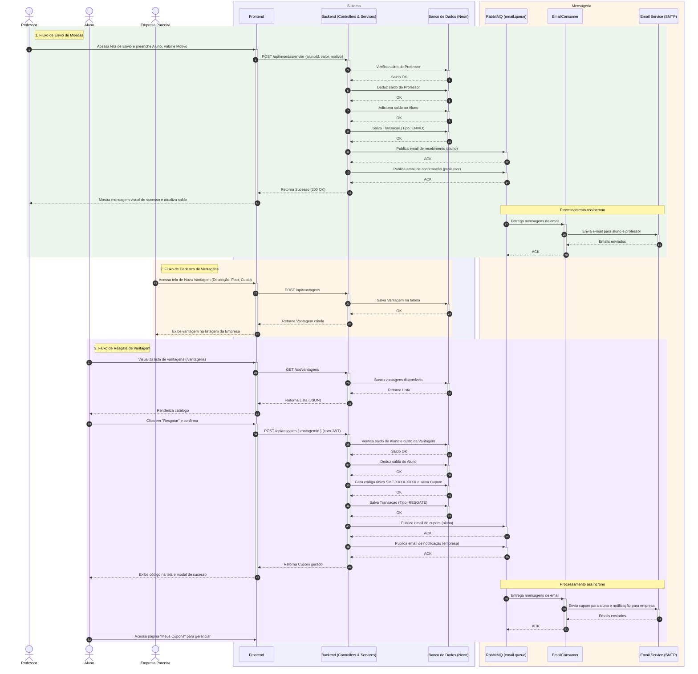

# Diagrama de Sequência Geral - Sistema de Moeda Estudantil

Este diagrama ilustra o fluxo completo e contínuo do sistema, envolvendo os três principais atores (Professor, Aluno, Empresa Parceira), desde o envio de moedas até o resgate e recebimento de cupons por e-mail. Inclui a camada de mensageria RabbitMQ para envio assíncrono de e-mails.

