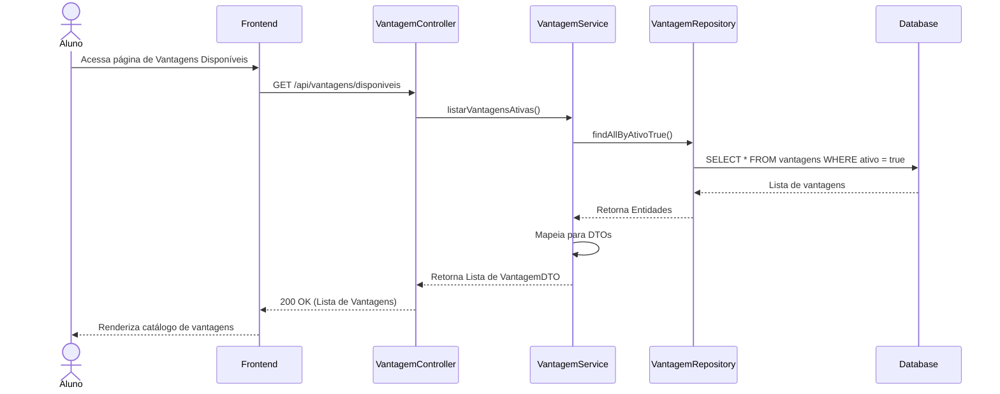

# Diagrama de Sequência: Listagem de Vantagens

```mermaid
sequenceDiagram
    actor A as Aluno
    participant F as Frontend
    participant C as VantagemController
    participant S as VantagemService
    participant R_Vant as VantagemRepository
    participant DB as Database

    A->>F: Acessa página de Vantagens Disponíveis
    F->>C: GET /api/vantagens/disponiveis
    C->>S: listarVantagensAtivas()
    S->>R_Vant: findAllByAtivoTrue()
    R_Vant->>DB: SELECT * FROM vantagens WHERE ativo = true
    DB-->>R_Vant: Lista de vantagens
    R_Vant-->>S: Retorna Entidades
    S->>S: Mapeia para DTOs
    S-->>C: Retorna Lista de VantagemDTO
    C-->>F: 200 OK (Lista de Vantagens)
    F-->>A: Renderiza catálogo de vantagens
```
