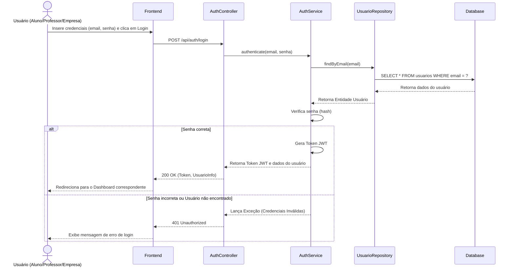

# Diagrama de Sequência: Login

```mermaid
sequenceDiagram
    actor U as Usuário (Aluno/Professor/Empresa)
    participant F as Frontend
    participant C as AuthController
    participant S as AuthService
    participant R as UsuarioRepository
    participant DB as Database

    U->>F: Insere credenciais (email, senha) e clica em Login
    F->>C: POST /api/auth/login
    C->>S: authenticate(email, senha)
    S->>R: findByEmail(email)
    R->>DB: SELECT * FROM usuarios WHERE email = ?
    DB-->>R: Retorna dados do usuário
    R-->>S: Retorna Entidade Usuário
    S->>S: Verifica senha (hash)
    alt Senha correta
        S->>S: Gera Token JWT
        S-->>C: Retorna Token JWT e dados do usuário
        C-->>F: 200 OK (Token, UsuarioInfo)
        F-->>U: Redireciona para o Dashboard correspondente
    else Senha incorreta ou Usuário não encontrado
        S-->>C: Lança Exceção (Credenciais Inválidas)
        C-->>F: 401 Unauthorized
        F-->>U: Exibe mensagem de erro de login
    end
```
