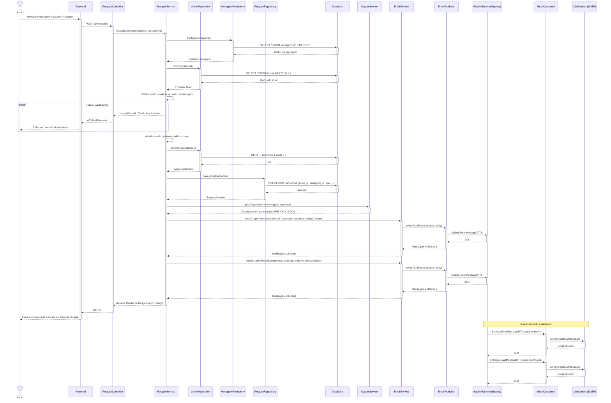

# Diagrama de Sequência: Resgate de Vantagem

```mermaid
sequenceDiagram
    actor A as Aluno
    participant F as Frontend
    participant C as ResgateController
    participant S as ResgateService
    participant R_Aluno as AlunoRepository
    participant R_Vant as VantagemRepository
    participant R_Resg as ResgateRepository
    participant DB as Database
    participant CS as CupomService
    participant ES as EmailService
    participant EP as EmailProducer
    participant RMQ as RabbitMQ (email.queue)
    participant EC as EmailConsumer
    participant M as MailSender (SMTP)

    A->>+F: Seleciona vantagem e clica em Resgatar
    F->>+C: POST /api/resgates
    C->>+S: resgatarVantagem(alunoId, vantagemId)

    S->>+R_Vant: findById(vantagemId)
    R_Vant->>+DB: SELECT * FROM vantagens WHERE id = ?
    DB-->>-R_Vant: Dados da vantagem
    R_Vant-->>-S: Entidade Vantagem

    S->>+R_Aluno: findById(alunoId)
    R_Aluno->>+DB: SELECT * FROM alunos WHERE id = ?
    DB-->>-R_Aluno: Dados do aluno
    R_Aluno-->>-S: Entidade Aluno

    S->>S: Verifica saldo do Aluno >= custo da Vantagem

    break Saldo Insuficiente
        S-->>C: Lança Exceção (Saldo Insuficiente)
        C-->>F: 400 Bad Request
        F-->>A: Exibe erro de saldo insuficiente
    end

    S->>S: Atualiza saldo do Aluno (saldo - custo)
    S->>+R_Aluno: save(alunoAtualizado)
    R_Aluno->>+DB: UPDATE alunos SET saldo = ?
    DB-->>-R_Aluno: OK
    R_Aluno-->>-S: Aluno atualizado

    S->>+R_Resg: save(novaTransacao)
    R_Resg->>+DB: INSERT INTO transacoes (aluno_id, vantagem_id, tipo, ...)
    DB-->>-R_Resg: Sucesso
    R_Resg-->>-S: Transação salva

    S->>+CS: gerarCupom(aluno, vantagem, empresa)
    CS-->>-S: Cupom gerado (com código SME-XXXX-XXXX)

    S->>+ES: enviarCupomAluno(aluno.email, vantagem.descricao, codigoCupom)
    ES->>+EP: enviarParaFila(to, subject, body)
    EP->>+RMQ: publish(EmailMessageDTO)
    RMQ-->>-EP: ACK
    EP-->>-ES: Mensagem enfileirada
    ES-->>-S: Notificação solicitada

    S->>+ES: enviarCupomEmpresa(empresa.email, aluno.nome, codigoCupom)
    ES->>+EP: enviarParaFila(to, subject, body)
    EP->>+RMQ: publish(EmailMessageDTO)
    RMQ-->>-EP: ACK
    EP-->>-ES: Mensagem enfileirada
    ES-->>-S: Notificação solicitada

    S-->>-C: Retorna Recibo de Resgate (com código)
    C-->>-F: 200 OK
    F-->>-A: Exibe mensagem de sucesso e código de resgate

    Note over RMQ, M: Processamento assíncrono
    RMQ->>+EC: Entrega EmailMessageDTO (cupom aluno)
    EC->>+M: send(SimpleMailMessage)
    M-->>-EC: Email enviado
    EC-->>-RMQ: ACK
    RMQ->>+EC: Entrega EmailMessageDTO (cupom empresa)
    EC->>+M: send(SimpleMailMessage)
    M-->>-EC: Email enviado
    EC-->>-RMQ: ACK
```
