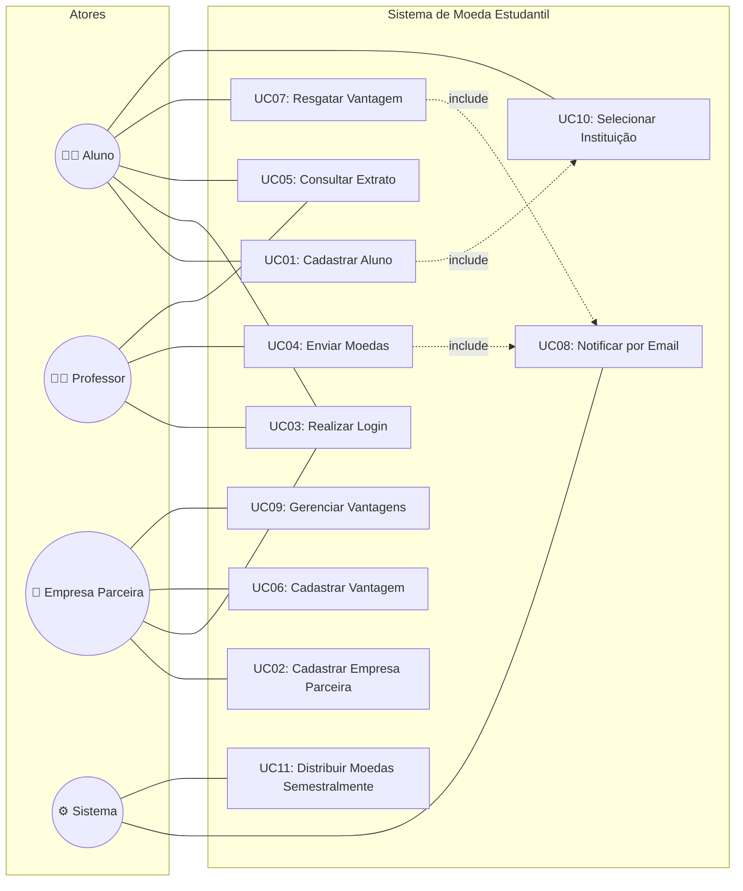
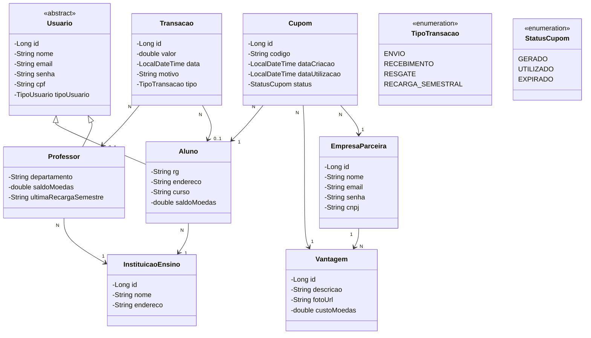
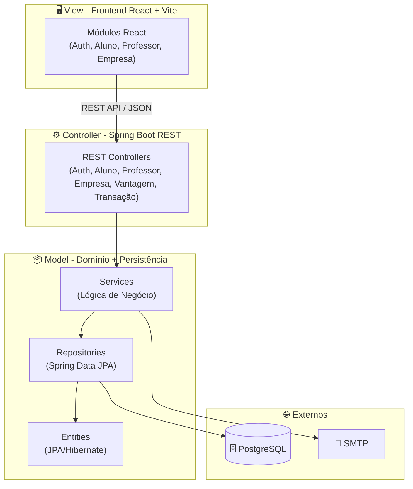

# Modelagem do Sistema — Sprint 1

## Sistema de Moeda Estudantil (Release 1)

**Disciplina:** Laboratório de Desenvolvimento de Software  
**Sprint:** 01 — Modelagem do Sistema  
**Data:** Abril/2026

---

## 📋 Sumário

1. [Descrição do Sistema](#1-descrição-do-sistema)
2. [Diagrama de Casos de Uso](#2-diagrama-de-casos-de-uso)
3. [Histórias do Usuário](#3-histórias-do-usuário)
4. [Diagrama de Classes](#4-diagrama-de-classes)
5. [Diagrama de Componentes](#5-diagrama-de-componentes)
6. [Decisões de Projeto](#6-decisões-de-projeto)

---

## 1. Descrição do Sistema

O **Sistema de Moeda Estudantil** é uma plataforma para estimular o reconhecimento do mérito estudantil através de uma moeda virtual. A moeda pode ser distribuída por professores aos seus alunos como forma de reconhecimento e trocada pelos alunos por produtos e descontos em empresas parceiras.

### Atores do Sistema

| Ator | Descrição |
|------|-----------|
| **Aluno** | Estudante cadastrado no sistema que pode receber moedas de professores e trocá-las por vantagens. |
| **Professor** | Docente pré-cadastrado que recebe 1.000 moedas/semestre para distribuir aos alunos. |
| **Empresa Parceira** | Empresa que oferece vantagens (descontos, produtos) em troca de moedas dos alunos. |
| **Sistema** | Ator automatizado responsável por notificações por email e distribuição semestral de moedas. |

### Regras de Negócio Principais

| ID | Regra |
|---|---|
| RN01 | Instituições de ensino são pré-cadastradas no sistema. |
| RN02 | Professores são pré-cadastrados pela instituição parceira. |
| RN03 | Cada professor recebe 1.000 moedas por semestre (acumulável). |
| RN04 | Para enviar moedas, o professor precisa ter saldo suficiente e informar um motivo obrigatório. |
| RN05 | Ao receber moedas, o aluno é notificado por email. |
| RN06 | O saldo de moedas nunca pode ficar negativo. |
| RN07 | Para cadastrar uma vantagem, a empresa deve incluir descrição, foto e custo em moedas. |
| RN08 | Ao resgatar uma vantagem, um cupom com código único é gerado e enviado por email ao aluno e à empresa parceira. |
| RN09 | Todos os atores (aluno, professor, empresa) precisam de login e senha para acessar o sistema. |
| RN10 | O email é utilizado como login para todos os tipos de usuário. |

---

## 2. Diagrama de Casos de Uso

📄 **Documento completo:** [diagrama_casos_uso.md](./diagramas/diagrama_casos_uso.md)

### Diagrama Resumido

### Lista de Casos de Uso

| ID | Caso de Uso | Ator(es) Principal(is) |
|---|---|---|
| UC01 | Cadastrar Aluno | Aluno |
| UC02 | Cadastrar Empresa Parceira | Empresa Parceira |
| UC03 | Realizar Login | Aluno, Professor, Empresa Parceira |
| UC04 | Enviar Moedas | Professor |
| UC05 | Consultar Extrato | Aluno, Professor |
| UC06 | Cadastrar Vantagem | Empresa Parceira |
| UC07 | Resgatar Vantagem | Aluno |
| UC08 | Notificar por Email | Sistema |
| UC09 | Gerenciar Vantagens | Empresa Parceira |
| UC10 | Selecionar Instituição | Aluno |
| UC11 | Distribuir Moedas Semestralmente | Sistema |

---

## 3. Histórias do Usuário

📄 **Documento completo:** [historias_usuario.md](../historias_usuario.md)

### Resumo

| ID | Ator | Título | Prioridade |
|---|---|---|---|
| US01 | Aluno | Cadastro no sistema | Alta |
| US02 | Aluno | Login no sistema | Alta |
| US03 | Aluno | Consultar extrato | Alta |
| US04 | Aluno | Resgatar vantagem | Alta |
| US05 | Aluno | Visualizar vantagens disponíveis | Média |
| US06 | Professor | Login no sistema | Alta |
| US07 | Professor | Enviar moedas a um aluno | Alta |
| US08 | Professor | Consultar extrato | Alta |
| US09 | Empresa | Cadastro no sistema | Alta |
| US10 | Empresa | Login no sistema | Alta |
| US11 | Empresa | Cadastrar vantagem | Alta |
| US12 | Empresa | Gerenciar vantagens | Média |
| US13 | Sistema | Notificar aluno por email | Alta |
| US14 | Sistema | Enviar cupom por email | Alta |
| US15 | Sistema | Distribuir moedas semestralmente | Alta |

---

## 4. Diagrama de Classes

📄 **Documento completo:** [diagrama_classes.md](./diagramas/diagrama_classes.md)

### Diagrama

### Entidades e Relacionamentos

| Entidade | Descrição | Relacionamentos |
|---|---|---|
| **Usuario** (abstrata) | Base para Aluno e Professor | — |
| **Aluno** | Estudante cadastrado | → InstituicaoEnsino (N:1), → Transacao (1:N), → Cupom (1:N) |
| **Professor** | Docente pré-cadastrado | → InstituicaoEnsino (N:1), → Transacao (1:N) |
| **EmpresaParceira** | Empresa que oferece vantagens | → Vantagem (1:N), → Cupom (1:N) |
| **InstituicaoEnsino** | Instituição parceira | ← Aluno (1:N), ← Professor (1:N) |
| **Vantagem** | Benefício oferecido | → EmpresaParceira (N:1), → Cupom (1:N) |
| **Transacao** | Registro de movimentação | → Aluno (N:1), → Professor (N:1) |
| **Cupom** | Cupom de resgate | → Aluno (N:1), → Vantagem (N:1), → EmpresaParceira (N:1) |

---

## 5. Diagrama de Componentes

📄 **Documento completo:** [diagrama_componentes.md](./diagramas/diagrama_componentes.md)

### Arquitetura MVC

O sistema segue a arquitetura **MVC (Model-View-Controller)** distribuída:

### Componentes Detalhados

| Camada | Componentes | Tecnologia |
|---|---|---|
| **View** | Módulos Auth, Aluno, Professor, Empresa | React 18 + Vite + Axios |
| **Controller** | AuthController, AlunoController, ProfessorController, EmpresaParceiraController, VantagemController, TransacaoController | Spring Boot 3.x |
| **Service** | AuthenticationService (JWT), EmailNotificationService (JavaMail), SchedulerService (Spring Scheduler), CupomService, etc. | Spring Boot |
| **Repository** | 7 interfaces JPA (uma por entidade) | Spring Data JPA |
| **Model** | 7 entidades + 3 enums | JPA/Hibernate |
| **Database** | PostgreSQL 16 | — |

---

## 6. Decisões de Projeto

### Stack Tecnológica

| Componente | Tecnologia | Justificativa |
|---|---|---|
| **Backend** | Java 17 + Spring Boot 3.x | Framework robusto, amplamente adotado, com suporte a JPA, Security e Mail |
| **Frontend** | React 18 + Vite | Performance, ecossistema rico, build tool moderna |
| **Banco de Dados** | PostgreSQL 16 | Banco relacional maduro, gratuito, com suporte a todas as features necessárias |
| **ORM** | Hibernate/JPA (via Spring Data) | Mapeamento objeto-relacional transparente, reduz boilerplate |
| **Autenticação** | Spring Security + JWT | Padrão da indústria, stateless, adequado para SPA |
| **Email** | Spring Boot Starter Mail (JavaMail) | Integração nativa com Spring, suporte a templates |
| **Scheduler** | Spring Scheduler (@Scheduled) | Nativo do Spring, sem dependências extras |

### Login e Autenticação

- O **email** é usado como login para todos os tipos de usuário (Aluno, Professor, Empresa Parceira).
- Senhas são armazenadas com **hash BCrypt**.
- A autenticação é feita via **JWT** (JSON Web Token).
- Três tipos de roles são definidos: `ROLE_ALUNO`, `ROLE_PROFESSOR`, `ROLE_EMPRESA`.

### Tratamento do Semestre

- O campo `ultimaRecargaSemestre` no Professor armazena o semestre da última recarga (ex: "2026/1").
- O `SchedulerService` verifica este campo para evitar créditos duplicados.
- A recarga pode ser disparada por CRON job ou manualmente por um administrador.
